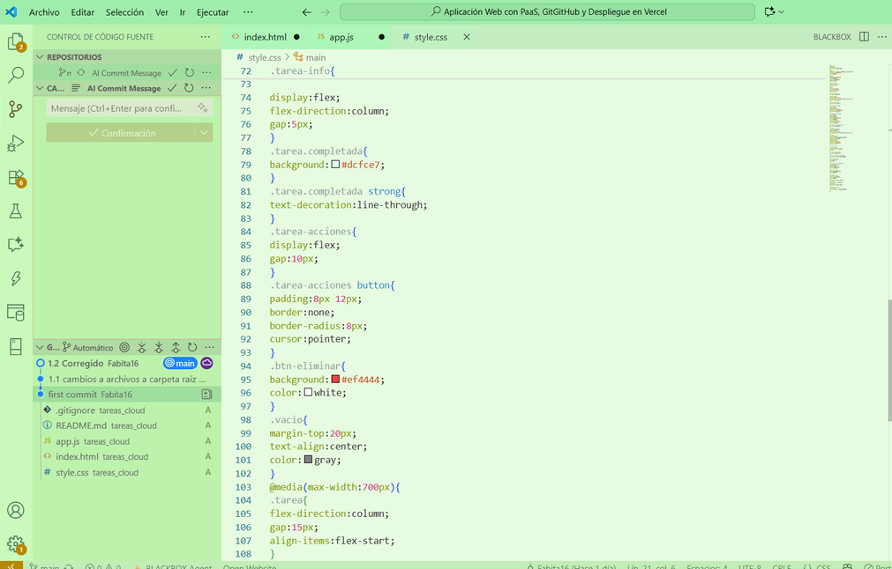
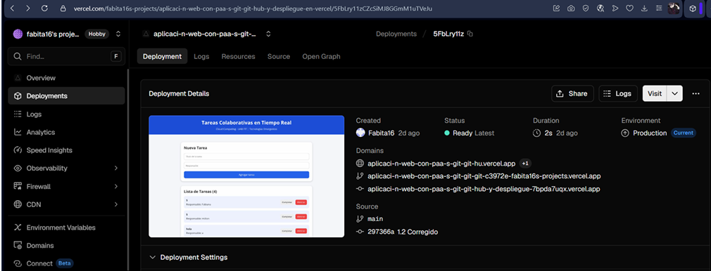
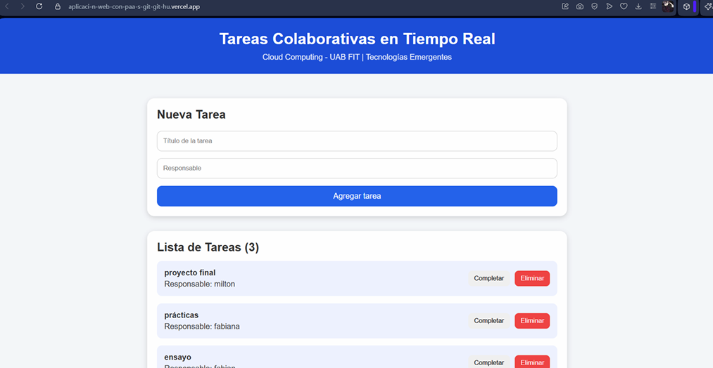

# Sistema de Tareas Colaborativas en Tiempo Real
## Descripción
Aplicación web desarrollada para la asignatura Tecnologías Emergentes.
Permite registrar tareas y sincronizarlas en tiempo real utilizando Supabase
como plataforma Backend as a Service (BaaS/PaaS).
## Tecnologías utilizadas
- HTML5
- CSS3
- JavaScript
- Supabase
- Git
- GitHub
- Vercel
## Funcionalidades
- Agregar tareas.
- Listar tareas.
- Actualización en tiempo real.
- Cambiar estado pendiente/completada.
- Eliminar tareas.
- Interfaz responsiva.
## Arquitectura
Cliente Web
↓
8
Vercel (Hosting)
↓
Supabase
- Base de datos PostgreSQL
- API REST
- Realtime
## Instalación
1. Clonar el repositorio:
git clone https://github.com/Fabita16/Aplicaci-n-Web-con-PaaS--GitGitHub-y-Despliegue-en-Vercel.git
2. Abrir la carpeta con Visual Studio Code.
3. Configurar:
- SUPABASE_URL = https://djjoyusnlhlopnwqsner.supabase.co
- SUPABASE_ANON_KEY =eyJhbGciOiJIUzI1NiIsInR5cCI6IkpXVCJ9.eyJpc3MiOiJzdXBhYmFzZSIsInJlZiI6ImRqam95dXNubGhsb3Bud3FzbmVyIiwicm9sZSI6ImFub24iLCJpYXQiOjE3ODE0NzE0OTcsImV4cCI6MjA5NzA0NzQ5N30...

4. Ejecutar index.html.
## Autores
- -------------------------------------------------- -
- -------------------------------------------------- -
- Fabiana Nicole Patiño Gutierrez 
- Milton Orellana Atoyay
- John Fabián Ernesto Nuñez Heredia
- --------------Ingeniería de Sistemas-------------- -
- --------------------UAB FIT----------------------- -
## Capturas
- LINK VERCEL = https://aplicaci-n-web-con-paa-s-git-git-hu.vercel.app

